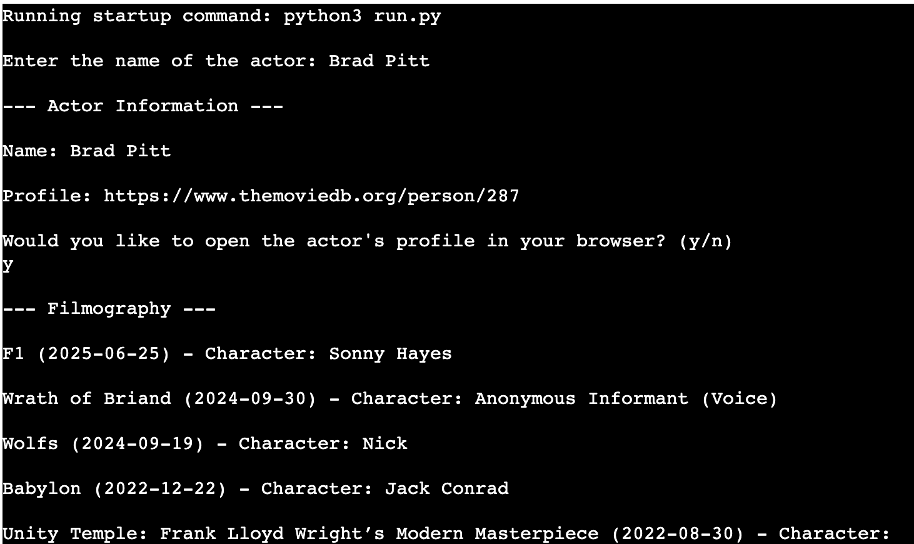

# Who's That Actor?!
### Project Description - Have you ever been watching a movie and for the life of you couldn't remember what movie you saw this actor in? Well, 'with Who's That Actor?!' say goodbye to your frustration. 

### With this program, quickly search for the actor's name and breathe a sigh of relief as it displays all the movies they have appeared in!

### Project Purpose - To help users find answers to their questions in regards to actors.

### How it benefits the Users, Users Demographic - It is targeted at movie lovers and film-fanatics, allowing them to quickly find the answer to their query.

# Features 

 

**Logo**

  - A large logo displaying the name of the program done via ASCII text.

  

Logo Screenshot

  

  

 

**User Input**

  - An interactive input function where the user will place the name of the actor they're looking for and execute the main logic of the page.

  

User's Input Screenshot

  

  

 

**Actor Information**

  - A small heading that details the actor's name and their 'The Movie DataBase' (TMDB) profile that the user can copy into their browser.

  

Actor Information Screenshot

  

  

 

**Filmography**

  - The filmography of the actor that was searched for. Detailing the movie's name, release date and the name of the character the actor played.

  

Filmography Screenshot

  

  

 

## Future Features
While the current version of the project is fully functional, we have some exciting features planned for future updates. Here are a few ideas that we didn't have time to implement in this release:

1. **More Actor Information**:
   - More information to be displayed in the actor information heading, including: Birthdate and notable movies.

## Manual Testing 

#### Features Testing

|  Feature |  Action | Effect |
|---|---|---|
|User Input|Type into input function|Types out onto the terminal as you type|
|User Input|Press enter with a correct value|Store and executes the value with the main logic.|
|User Input|Press enter with an incorrect value|Throws up an error message|

#### Pep8 Checker

**Introduction**
- Checked my code against the pep8 checker supplied by Code Institute: https://pep8ci.herokuapp.com/

**Results**
- Python code came out the checker with no errors.

**Details**
- Before putting it through the checker I ran the flake8 Python tool to detail formatting and code based errors which showed me formatting errors such as whitespace, and lines breaking the 79 word limit.
-  I also used the black Python tool to format my code.

**Visuals**

 

#### Bugs Resolved

**Introduction**
This section provides a summary of bugs that have been identified, reported, and subsequently resolved in Who's That Actor?!.

Below is a summary of resolved bug:

| Bug ID | Bug Description | Status |
|--------|-----------------|--------|
| #001   | - Attempted to use the webbrowser module to allow users to click on the actor's profile link and have it open in their browser. However, after installing and executing it, it wasn't working on my deployed heroku app. Eventually found out that heroku doesn't work with this module so had to remove that feature.| Resolved |

**Images**: 

Bug Screenshot 1 (Gitpod Terminal)

  

  

Bug Screenshot 2 (Heroku App)

  

  

## Deployment

- The site was deployed using Heroku pages. Using Code Institute's Git repository as its base, the steps are as follows:
  - Create a new Heroku App.
  - Set the config vars to hide my API, and the PORT that Code Institute recommended.
  - Linked the Heroku app to the repository.
  - Set it to automatic deployment.

The live link can be found here - https://whos-that-actor-054db717adce.herokuapp.com/

## Credits 

**The development of this project was aided by the following:**

[Colorama](https://pypi.org/project/colorama/) - used to add colour to the terminal.

[Heroku](https://www.heroku.com/home) - used to host and deploy the finished project.

[black](https://pypi.org/project/black/) - used to format my code via the terminal.

[flake8](https://pypi.org/project/flake8/) - used to check for pep8 formatting issues.

[os](https://docs.python.org/3/library/os.html) - used to clear the screen when switching between menus or views.

[PEP8](https://pep8ci.herokuapp.com/) - was used to validate the Python code.

[Sys](https://docs.python.org/3/library/sys.html) - used to create the typing effect on certain text outputs.

[Time](https://docs.python.org/3/library/time.html) - used to create delays in the program when switching between menus or performing operations.

[ASCII](https://manytools.org/hacker-tools/ascii-banner/) - used to create a logo for the program.

[Typing-effect](https://www.101computing.net/python-typing-text-effect/) - code from this site adapted to my project to create a typing effect in the terminal.

[TMDB](https://www.themoviedb.org/) - the website that my project searches through for the result of the user's input. Used an API from this website to achieve it.